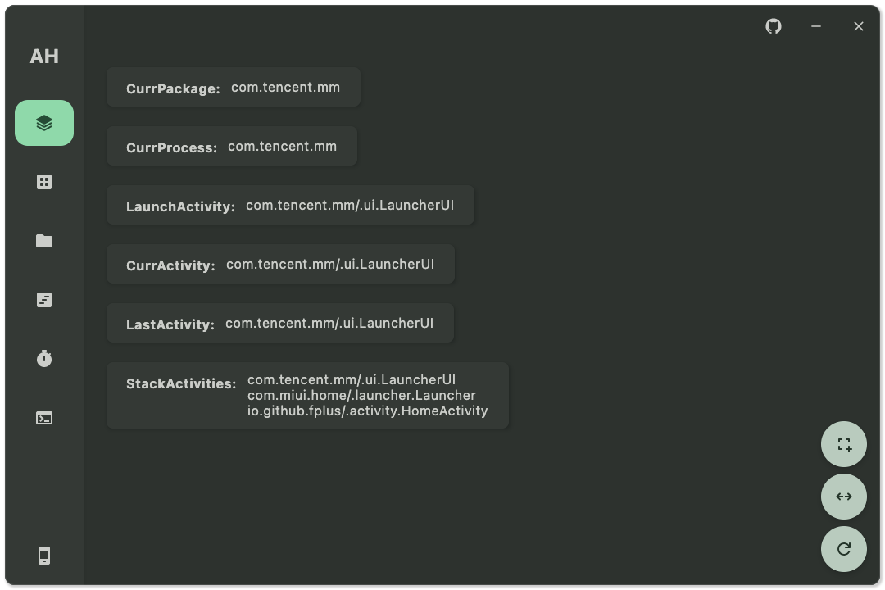

# Android Visual ADB Tool

[中文文档](https://github.com/GangJust/AdbHelper/blob/master_v2/docs/README.md) | [English](https://github.com/GangJust/AdbHelper/blob/master_v2/docs/README-EN.md)

Using [Rust JNI](https://github.com/jni-rs/jni-rs)  + [Kotlin Multiplatform](https://www.jetbrains.com/help/kotlin-multiplatform-dev/get-started.html)
layered design, Rust is responsible for ADB commands, KMP is responsible for UI.

Designed using MVI with a clear structure and simple functionality.

- Current features：
  - [x] Multi-device list
  - [x] Activity information
  - [x] App management
  - [x] File management

- Scheduling features：
  - [ ] Layout analysis
  - [ ] Scheduled tasks
  - [ ] Simple terminal

## Running Configuration

When running in IDEA, manually edit `Edit Configurations` and add the `-Pdeubg=true` parameter after the `Run` command
to generate the `BuildConfig` class.

Custom `GradleTask` used by the project:

- `composeApp:run*` related tasks
  - Please manually add the `-Pdeubg=true` parameter.

- `composeApp:build*` related tasks
  - Please manually add the `-Pdeubg=true` parameter.

- `composeApp:clear*` related tasks
  - Please manually add the `-Pdeubg=true` parameter.

- `composeApp:createDistributable`
  - Please find the compiled product folder in the `composeApp/build/compose/binaries` directory.

- `composeApp:*Release` related tasks (no solution found yet)
  - The task has problems after compilation and running, typical problems include:
  - `Dispatchers.Main` cannot be found after Release.
  - `Gson`'s `JsonObject` is compiled and optimized after Release, trying to set `optimize.set(false)` still exists.

you need to manually solve these problems.

## Other Notes

Instead of relying on the `Rerun` and `Stop` buttons at the top of `IDEA` (especially for Windows), manually click on
the close button in the top right corner of `ADB Helper` and manually `Run/Debug` again. Otherwise, you will need to
actively kill the `adb` process in `Task Manager` to resolve the stuck issue.

**Also, this project welcomes PRs from everyone, and if you have any questions, please feel free to ask.**

## Additional Screenshots



## License

[GNU General Public License v3.0](https://www.gnu.org/licenses/)

```text
Copyright (C) 2024  Gang

This program is free software: you can redistribute it and/or modify
it under the terms of the GNU General Public License as published by
the Free Software Foundation, either version 3 of the License, or
(at your option) any later version.

This program is distributed in the hope that it will be useful,
but WITHOUT ANY WARRANTY; without even the implied warranty of
MERCHANTABILITY or FITNESS FOR A PARTICULAR PURPOSE.  See the
GNU General Public License for more details.

You should have received a copy of the GNU General Public License
along with this program.  If not, see <https://www.gnu.org/licenses/>.
```
