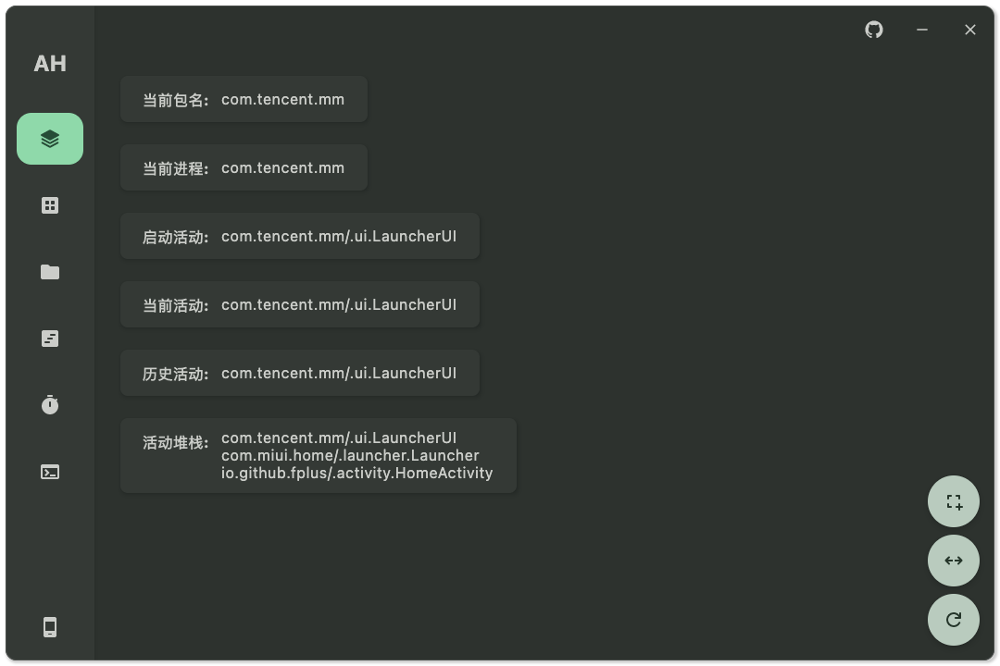

# Android可视化ADB工具

[中文文档](https://github.com/GangJust/AdbHelper/blob/master_v2/docs/README.md) | [English](https://github.com/GangJust/AdbHelper/blob/master_v2/docs/README-EN.md)

采用 [Rust JNI](https://github.com/jni-rs/jni-rs) + [Kotlin Multiplatform](https://www.jetbrains.com/help/kotlin-multiplatform-dev/get-started.html)
分层设计，Rust负责ADB命令，KMP负责UI。

使用MVI设计，结构明确，功能简单。

- 目前功能：
  - [x] 多设备列表
  - [x] 活动信息
  - [x] 应用管理
  - [x] 文件管理

- 计划功能：
  - [ ] 布局分析
  - [ ] 定时任务
  - [ ] 简易终端

## 运行配置

IDEA运行时，请手动编辑 `Edit Configurations` 在 `Run` 命令后增加 `-Pdeubg=true` 参数，以便于`BuildConfig`类的产生。

项目使用的自定义`GradleTask`：

- `composeApp:run*` 相关任务
  - 请手动增加 `-Pdeubg=true` 参数。

- `composeApp:build*` 相关任务
  - 请手动增加 `-Pdeubg=true` 参数。

- `composeApp:clear*` 相关任务
  - 请手动增加 `-Pdeubg=true` 参数。

- `composeApp:createDistributable`
  - 请在`composeApp/build/compose/binaries`目录下找到编译后的产物文件夹。

- `composeApp:*Release` 相关任务 (暂未找到解决方案)
  - 该任务编译编译后运行存在问题，典型问题为：
  - `Dispatchers.Main` 在Release后无法被找到。
  - `Gson`的`JsonObject` 在Release后被编译优化，尝试设置`optimize.set(false)`仍然存在。

你需要手动解决这些问题。

## 其他说明

不要依赖于`IDEA`顶部的`Rerun`和`Stop`按钮(特别是Windows)，请手动点击`ADB Helper`右上角的关闭按钮，并重新手动`Run/Debug`。
否则，你需要在`任务管理器`中主动杀死`adb`进程，来解决卡住的问题。

**另外，本项目欢迎各位的PR，如果有任何问题，欢迎提出。**

## 补充截图



## License

[GNU General Public License v3.0](https://www.gnu.org/licenses/)

```text
Copyright (C) 2024  Gang

This program is free software: you can redistribute it and/or modify
it under the terms of the GNU General Public License as published by
the Free Software Foundation, either version 3 of the License, or
(at your option) any later version.

This program is distributed in the hope that it will be useful,
but WITHOUT ANY WARRANTY; without even the implied warranty of
MERCHANTABILITY or FITNESS FOR A PARTICULAR PURPOSE.  See the
GNU General Public License for more details.

You should have received a copy of the GNU General Public License
along with this program.  If not, see <https://www.gnu.org/licenses/>.
```
